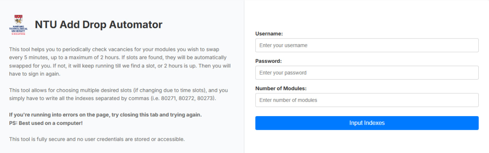
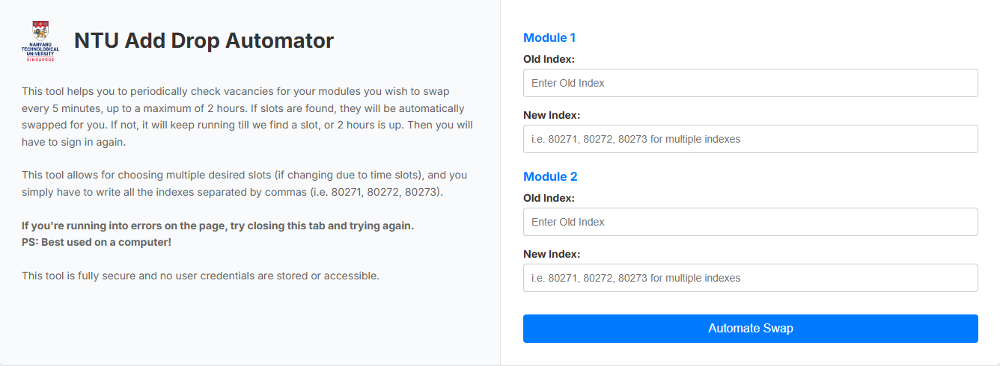
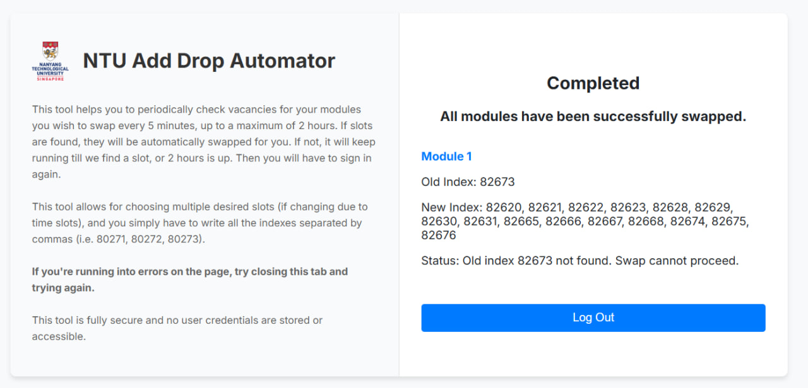

# NTU Add Drop Automator (Flask Version)

## Problem Statement
To help NTU students arrange their modules and classes efficiently during the add drop period at the start of each semester (January, August).

Nanyang Technological University students have always faced the issue of having to 'camp' on the school portal, to wait for vacancies for the class slots they want, due to it being first-come-first-serve. This manual slot checking for slot timings for the classes students want is an inconvenience at the start of every semester.

This web application provides a solution to this problem: by making use of web agents automate the process of logging into the school website to attempt swaps for course indexes.

## The Solution
A full-stack web application used by 550+ NTU students to automate course swapping using web agents, reducing manual slot checking by 40%, with a tech stack comprising of a FastAPI backend, HTML, CSS, JS frontend, and Docker for deployment on Render.

How this application works is that it makes use of web agents to automatically log into the school portal every five minutes, to check and attempt swaps for course indexes. If there are no slots, the web agent will try again every five minutes, until a swap is found or 2 hours is up, whichever is sooner.

This is the original version of the site used in Jan 2025, with some tweaks as this is used for deployment on Render, while it was originally deployed on a DigitalOcean droplet using Docker. There were numerous limitations of this application on Flask, most notably the inability to maximize the number of concurrent users of the app, which resulted in me having to upgrade the specs of my server and which cost me money.

With the app migrated onto FastAPI in the new folder, it will solve the issue to a large degree, and will be built for high traffic compared to this Flask version.

## How can we use this web application?

### 1. Home Page
On the home screen, you are presented with 3 input fields: your username and password for the school portal, as well as the number of modules you wish to swap. These sensitive details of username and password are not stored on any server or database beyond your session and is only used during your session for the functioning of the app to execute your course swaps. Once your session has ended, the user credentials are forgotten and not stored. These credentials are also not accessible to anyone including me.

### 2. Input Indexes Page
On the next page, you are presented with 2 input fields for every module you wish to swap: the old index and new index(es). For each module, you simply need to enter in the old index of the module you wish to swap out of (you do not need to key in the course code), and the new indexes (at least 1), that you wish to enter. If you wish to attempt swaps for multiple new indexes, you can enter it all into the same input field, separated by a comma and a space, i.e. "80271, 80272, 80273"

### 3. Swap Status Page
On the final page, you are presented with a swap status page which shows the status for all the modules you are attempting to swap. Once done, you will be shown a "Completed" status, as below.

## Feedback
Feel free to reach out if you have any feedback or are running into any issues on Telegram [@uneasymoneysniper](t.me/uneasymoneysniper).

I'm also open to any collaborations! Especially with the frontend haha as it's not very nice-looking.
